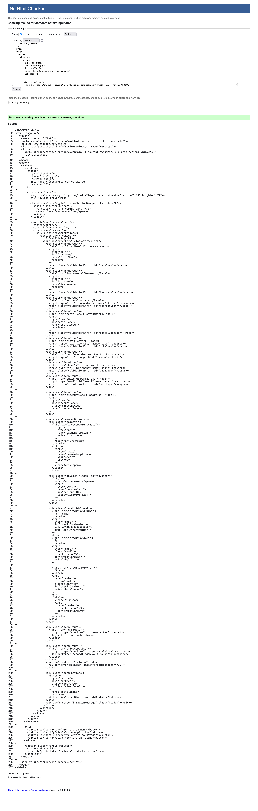
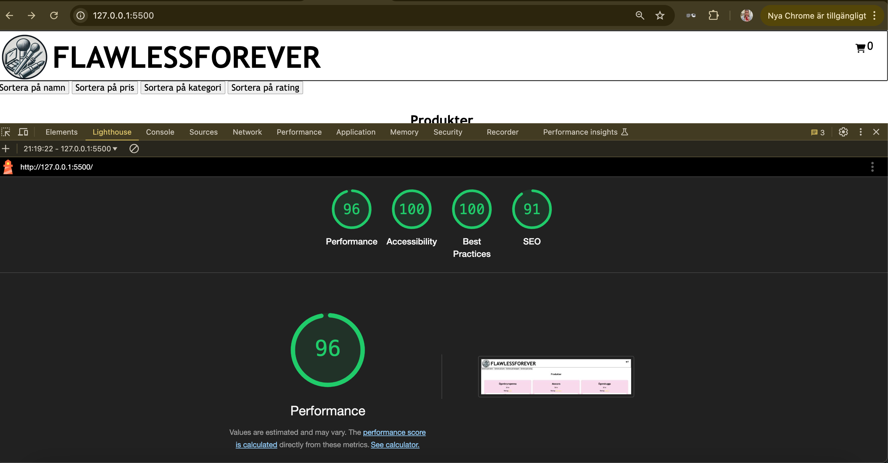

# 🛍️ FlawlessForever Webshop  

## 📌 Projektbeskrivning  
FlawlessForever är en grundläggande webbutik där användare kan:  

- ✅ Lägga till och ta bort produkter i kundvagnen  
- ✅ Justera mängden av varje produkt  
- ✅ Se totalpriset för varukorgen, inklusive fraktkostnader  
- ✅ Välja betalmetod (kort eller faktura)  
- ✅ Validera och skicka ett beställningsformulär  

---

## 🛠️ Teknikstack  
### 🔹 Använda teknologier  
- **HTML**  
- **CSS (SASS)**  
- **Vanilla JavaScript**  

---

## ✅ Valideringsrapporter  
### 📄 CSS Validering  
  

### 📄 HTML Validering  
  

---

## 🚀 Lighthouse-analys  
### 📊 Prestanda och tillgänglighet  
Lighthouse-analysen visar prestanda, tillgänglighet och bästa praxis för webbplatsen.  
  

---

## 🌍 Live-demo  
### 🔗 Se projektet live här:  
👉 [FlawlessForever Webshop](https://medieinstitutet.github.io/fed24d-js-intro-inl-1-webshop-axandranathalie/)  

---

Den här versionen är tydligare och mer organiserad med `###` för sektioner där det behövs. Hoppas du gillar den! 😊

